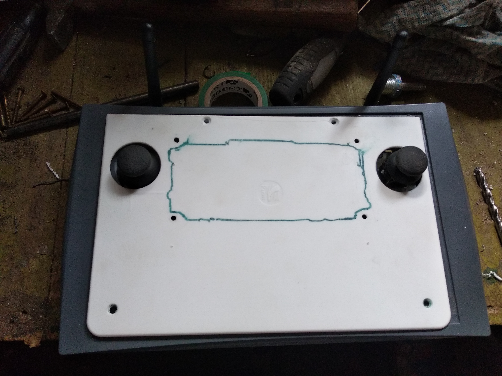

# Vehicle controller
### Vehicle controller - university project

## Table of contents
- [Description](#description) 
  - [Capabilities](#capabilities) 
  - [MCU used](#mcu-used) 
  - [IDE and other software used](#ide-and-other-software-used)
  - [Programing language](#programing-language)
- [Gallery](#gallery)

## Description
Vehicle controller with LCD touch screen, as interface. 
Equipped with pair of joysticks for manuvering purpose.  
For communication it uses nRF24L0+ and ESP32.
It has also voltometer on board, to check voltage on batteries.

It is RTOS based project.

## Capabilities

The vehicle controller capabilities are listed below:
- Radio controling vehicle via nRF24L0+ or ESP32
- Representing any data related to the vehicle
- Inspecting and diagnosing state of the vehicle and its sensors 

## MCU used

- STM32F469
- ESP32
- nRF24L0+

## IDE and other software used

- STM32 Cube IDE (Eclipse)
- STM32 Cube MX
- TouchGFX Designer
- STM Studio
- Visual Studio Code

## Programing language

C/C++

## Gallery

### Demonstration video: 
[https://www.youtube.com/watch?v=05ctpChbDyU&list=PLEnQao540nqFc1qfwu35HFDQ93fBx2bAW](https://www.youtube.com/watch?v=05ctpChbDyU&list=PLEnQao540nqFc1qfwu35HFDQ93fBx2bAW)

### Photos 

 
 
 
 Workshop photo 

   
 
 
 
 Controller v1 - with additional STM32F411CC and without ESP32 (early version)  

 
 
 
 
 Controller v2 

 

 
 
 
 

 

  
